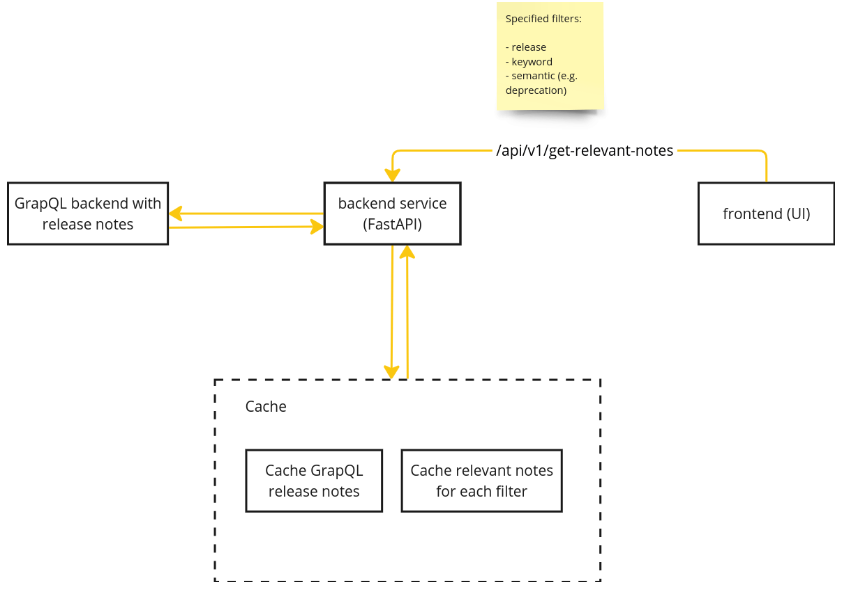

# Digital roadmap backend PoC

FastAPI application with Redis integration for caching or data storage, using `Uvicorn` as the ASGI server.

## Prerequisites

Before you begin, ensure you have the following installed:

- Python 3.7 or later
- Redis (local installation or access to a remote Redis server)

## Setup Instructions

1. Clone this repository
2. Create a virtual environment and activate it `make install`
3. `make run`
4. Take a look at the docs endpoint at `http://127.0.0.1:8000/docs`

**NOTE: For now the release notes data are mocked and only 9.0 works**

## TODO Improvements

- [ ] caching of queried release notes and the tagged relevant notes(redis, memcached etc.)
- [ ] use real GraphQL API to fetch release notes (https://spaces.redhat.com/pages/viewpage.action?spaceKey=GAP&title=Red+Hat+GraphQL+API+Platform)
- [ ] tests
- [ ] improve the primitive keyword search (e.g semantic search)
